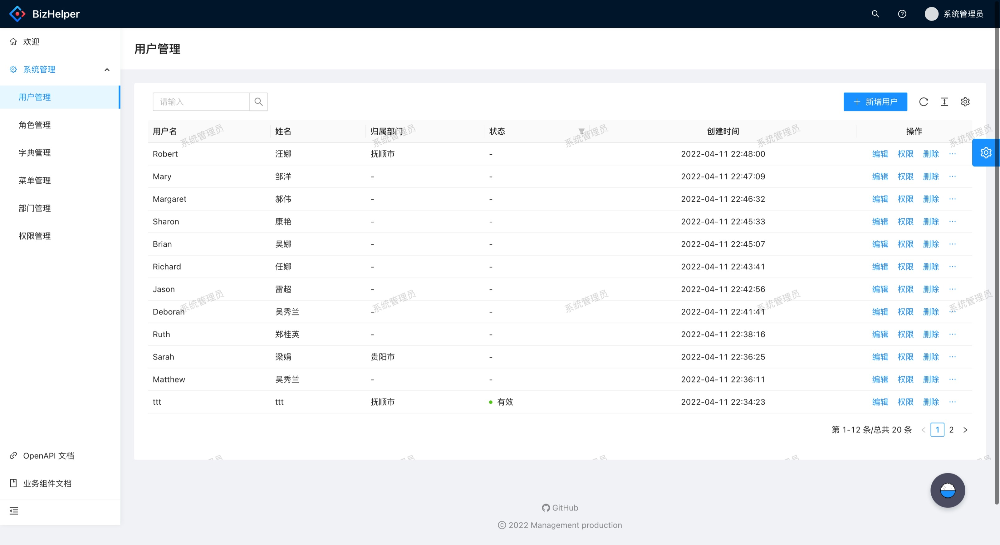
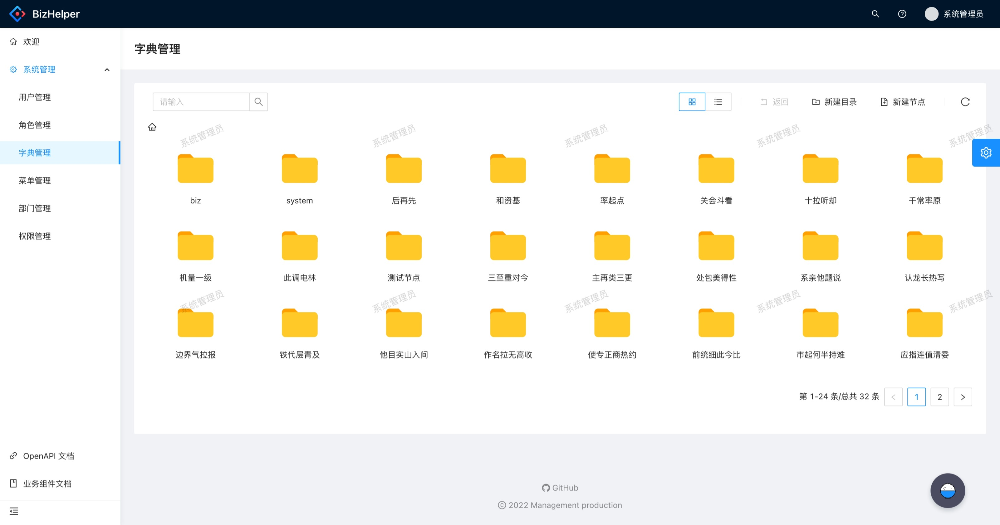
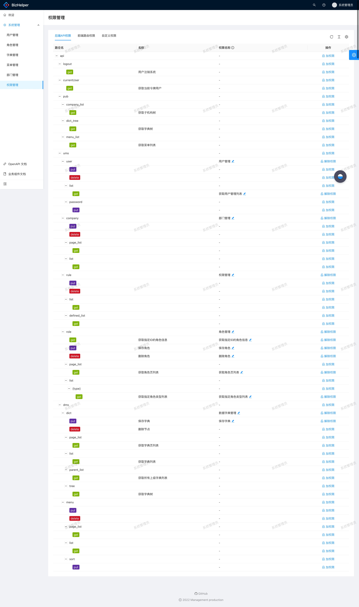
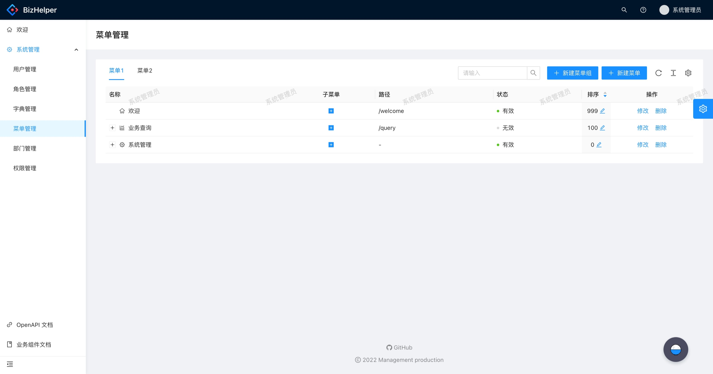

<h1 align="center">BizHelper 项目-python后台</h1>

<h5 align="center">于2022年疫情隔离期间创建的共享中后台管理框架</h5>

----

基于python语言，FastApi+SQLAlchemy框架开发

#### 目前具备以下几项功能：

* 用户管理：实现了用户增删改，用户角色管理
* 字典管理：本项目字典管理采用文件夹管理方式，可以说是本项目一大特色
* 菜单管理：系统菜单管理，根据菜单路径判断权限
* 权限管理：分后端API，前端路由，自定义权限三块，自定义权限主要是前端按钮级权限使用，后端权限调用openapi生成API树进行权限设置
* 角色管理：无需多说
* 部门管理：无需多说

----

目前项目还是初始阶段，希望大家能共同维护，下面上截图：

